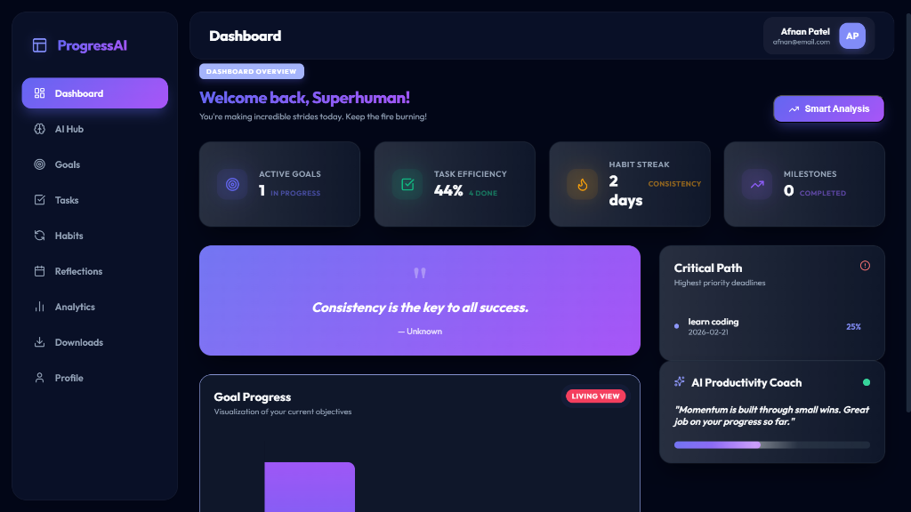
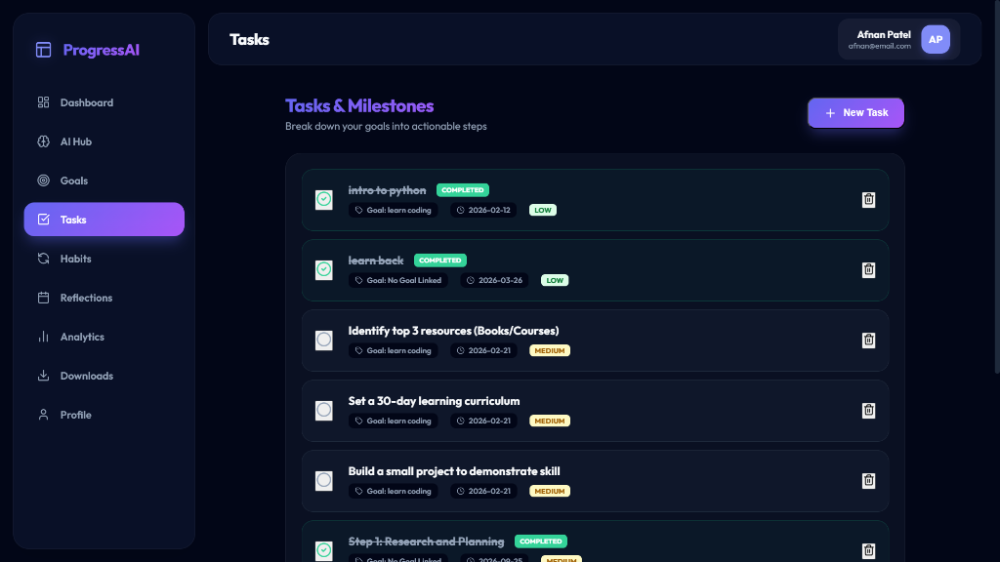
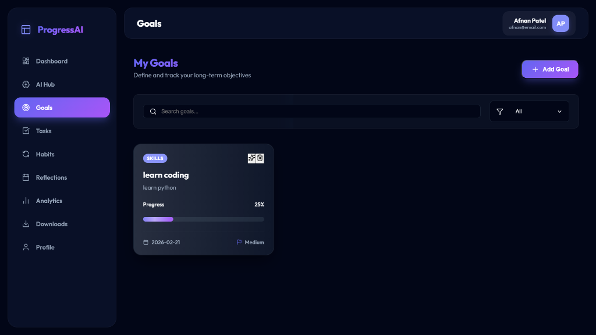
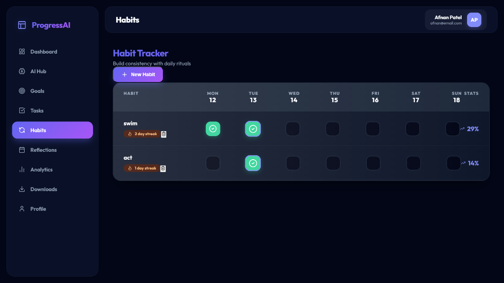

# ProgressAI - Personal Progress Tracker

**ProgressAI** is a futuristic, intelligence-driven productivity system designed to elevate your personal growth. It combines advanced task management with simulated neural insights to help you build consistency, visualize momentum, and achieve your long-term objectives.

## 🚀 Key Features

*   **Smart Goal Strategy**: Instantly break down ambitious goals into actionable, bite-sized tasks using our simulated neural analysis engine.
*   **Live Performance Coaching**: Receive dynamic, real-time feedback on your productivity velocity and focus levels directly on your dashboard.
*   **Visual Habit Tracking**: Build lasting routines with a streak-based habit engine that visualizes your consistency over time.
*   **Neural Forecasting**: The "AI Hub" analyzes your current pace to predict goal completion dates, keeping you realistic and on track.
*   **Daily & Weekly Reflections**: A dedicated journaling system to review your progress, learn from setbacks, and plan your next moves.
*   **Comprehensive Analytics**: Deep-dive into your performance metrics to understand your peak productivity windows and improvement areas.

## 📸 Application Overview

### Command Center
Your central hub for real-time stats, critical deadlines, and immediate AI coaching insights.


### Neural Intelligence Hub
Visual forecasts of your goal velocity and cognitive load analysis to optimize your workflow.


### Goal Management
Track high-level objectives with visual progress bars, priority tags, and automated breakdown tools.


### Actionable Task Board
A focused interface to manage daily to-dos, linked directly to your larger goals.


### Habit Consistency Engine
Monitor your daily rituals and streaks to build discipline.


---

## 💡 How to Use ProgressAI

1.  **Define Your Vision**: Start by adding your major objectives in the **Goals** tab. Use the "AI Strategist" button to automatically generate a roadmap of tasks.
2.  **Execute Daily**: Check the **Dashboard** for your "Critical Path"—the most urgent tasks that move the needle.
3.  **Build Discipline**: Use the **Habits** tracker to mark off daily rituals. Consistency is key to the "Habit Streak" score.
4.  **Review & Adapt**: End your day with a quick **Reflection** log. What went well? What didn't?
5.  **Monitor Growth**: Visit the **AI Hub** and **Analytics** weekly to see your "Velocity Forecast" and adjust your pace accordingly.

## 🛠️ Technology Stack

*   **Frontend**: React.js (Vite)
*   **Styling**: Custom CSS with Glassmorphism Design System
*   **Icons**: Lucide React
*   **Data Visualization**: Chart.js
*   **Persistence**: LocalStorage (Privacy-focused, no server required)

## 📦 Installation

To run this project locally:

1.  Clone the repository:
    ```bash
    git clone https://github.com/Afnanpatel/Progress-AI.git
    ```
2.  Install dependencies:
    ```bash
    npm install
    ```
3.  Start the application:
    ```bash
    npm run dev
    ```

## 📄 License
MIT
